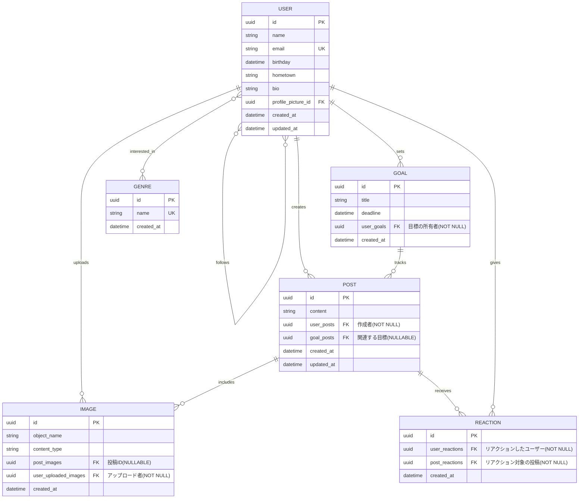

# Entity Relationship Diagram

このドキュメントは、p-logバックエンドのデータベーススキーマを表すER図です。

## エンティティの説明

### USER (ユーザー)
ユーザー情報を管理するエンティティです。
- プロフィール情報（名前、メール、誕生日、出身地、自己紹介）を持ちます
- `profile_picture_id`: プロフィール画像のImageエンティティへの参照（任意）
- 他のユーザーをフォローする自己参照リレーションシップを持ちます（中間テーブル`user_following`で管理）
- 複数のジャンルに興味を持つことができます（中間テーブル`user_genres`で管理）

### POST (投稿)
ユーザーが作成する投稿を管理するエンティティです。
- `content`: 投稿のテキストコンテンツ（任意）
- `user_posts`: 投稿を作成したユーザーのID（必須、外部キー）
- `goal_posts`: 関連付けられた目標のID（任意、外部キー、ON DELETE SET NULL）
- 複数の画像を含むことができます
- 複数のリアクションを受け取ることができます
- インデックス: `created_at`, `goal_posts`, `user_posts`

### GOAL (目標)
ユーザーが設定する目標を管理するエンティティです。
- `title`: 目標のタイトル（必須）
- `deadline`: 目標の期限（任意）
- `user_goals`: 目標を設定したユーザーのID（必須、外部キー）
- 複数の投稿を関連付けることができます
- **注意**: `updated_at`フィールドは存在しません

### IMAGE (画像)
アップロードされた画像を管理するエンティティです。
- `object_name`: GCSのオブジェクトパス（例: "images/{uuid}.jpg"）（必須）
- `content_type`: MIMEタイプ（例: "image/jpeg"）（必須）
- `user_uploaded_images`: 画像をアップロードしたユーザーのID（必須、外部キー）
- `post_images`: 画像が紐付けられた投稿のID（任意、外部キー、ON DELETE SET NULL）
- インデックス: `post_images`, `user_uploaded_images`

### REACTION (リアクション)
投稿に対するリアクション（いいねなど）を管理するエンティティです。
- `user_reactions`: リアクションしたユーザーのID（必須、外部キー）
- `post_reactions`: リアクション対象の投稿のID（必須、外部キー）
- 1ユーザー・1投稿につき1リアクションという制約があります（`user_reactions`と`post_reactions`の複合ユニーク制約）

### GENRE (ジャンル)
ユーザーの興味のあるジャンルを管理するエンティティです。
- `name`: ジャンル名（一意）
- ユーザーとの多対多リレーションシップを持ちます（中間テーブル`user_genres`で管理）

## 中間テーブル（entが自動生成）

### user_genres
USERとGENREの多対多リレーションシップを管理します。
- `user_id` (PK, FK → USER, ON DELETE CASCADE)
- `genre_id` (PK, FK → GENRE, ON DELETE CASCADE)
- 複合主キー: (`user_id`, `genre_id`)

### user_following
USERの自己参照フォロー関係を管理します。
- `user_id` (PK, FK → USER, ON DELETE CASCADE): フォローされているユーザー
- `follower_id` (PK, FK → USER, ON DELETE CASCADE): フォローしているユーザー
- 複合主キー: (`user_id`, `follower_id`)

## リレーションシップの詳細

- **USER ⇔ GENRE**: 多対多（ユーザーは複数のジャンルに興味を持ち、ジャンルは複数のユーザーに関連付けられる）
- **USER → GOAL**: 1対多（ユーザーは複数の目標を持つ。ユーザー削除時: NO ACTION）
- **USER → POST**: 1対多（ユーザーは複数の投稿を作成。ユーザー削除時: NO ACTION）
- **USER → REACTION**: 1対多（ユーザーは複数のリアクションを作成。ユーザー削除時: NO ACTION）
- **USER → IMAGE**: 1対多（ユーザーは複数の画像をアップロード。ユーザー削除時: NO ACTION）
- **USER → USER**: 多対多（フォロー関係。ユーザー削除時: CASCADE）
- **GOAL → POST**: 1対多（目標には複数の投稿が関連付けられる。目標削除時: SET NULL）
- **POST → IMAGE**: 1対多（投稿は複数の画像を含む。投稿削除時: SET NULL）
- **POST → REACTION**: 1対多（投稿は複数のリアクションを受け取る。投稿削除時: NO ACTION）

## データベーススキーマの詳細

### 外部キー削除動作
- **NO ACTION (a)**: 参照先が削除されようとするとエラー
  - `goals.user_goals` → `users.id`
  - `posts.user_posts` → `users.id`
  - `images.user_uploaded_images` → `users.id`
  - `reactions.user_reactions` → `users.id`
  - `reactions.post_reactions` → `posts.id`

- **SET NULL (n)**: 参照先が削除されるとNULLに設定
  - `posts.goal_posts` → `goals.id`
  - `images.post_images` → `posts.id`

- **CASCADE (c)**: 参照先が削除されると一緒に削除
  - `user_following.user_id` → `users.id`
  - `user_following.follower_id` → `users.id`
  - `user_genres.user_id` → `users.id`
  - `user_genres.genre_id` → `genres.id`

### テーブル名の命名規則
entフレームワークでは、エッジ（リレーション）名を用いて外部キーカラム名が生成されます：
- `{参照元テーブル名}_{エッジ名}`の形式
- 例: `user_posts`（usersテーブルのpostsエッジ）、`goal_posts`（goalsテーブルのpostsエッジ）

## スキーマ検証（2025年12月12日実施）

実際のPostgreSQLデータベースのスキーマを調査し、ER図との整合性を確認しました。

### 確認したテーブル
- ✅ `users` - 9カラム、emailにUNIQUE制約
- ✅ `posts` - 6カラム、3つのインデックス
- ✅ `goals` - 5カラム（`updated_at`なし）
- ✅ `images` - 6カラム、2つのインデックス
- ✅ `reactions` - 4カラム、複合UNIQUE制約
- ✅ `genres` - 3カラム、nameにUNIQUE制約
- ✅ `user_genres` - 2カラム、複合主キー
- ✅ `user_following` - 2カラム、複合主キー

### 確認した外部キー制約（11個）
すべての外部キー制約が正しく設定されていることを確認しました。各制約の削除動作（NO ACTION / SET NULL / CASCADE）も検証済みです。

### 主な発見事項
1. **外部キーのカラム名**: entが自動生成する命名規則に従っています（例: `user_posts`, `goal_posts`）
2. **GOALテーブル**: `updated_at`カラムは存在しません（スキーマ定義にも未定義）
3. **削除動作の適切な設定**: 
   - 重要なデータは NO ACTION で保護
   - 関連データは SET NULL で柔軟に対応
   - 中間テーブルは CASCADE で自動削除

このER図は実際のデータベーススキーマと完全に一致しています。
